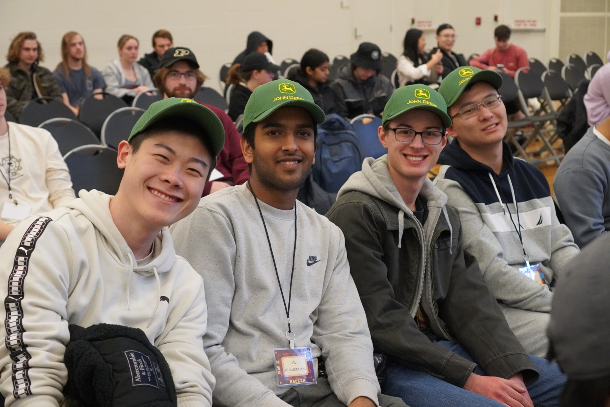
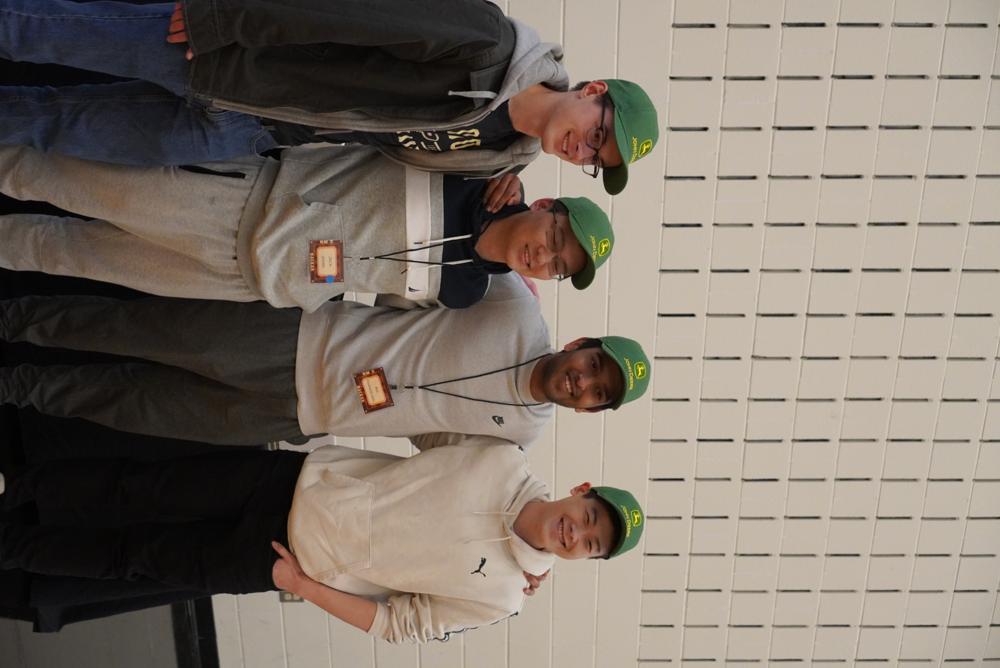

# Oh Deere Farms - Winner of the John Deere Best Farming Simulator

Authors: Jack Jiang, Steven Schonlau, Andy Lam, and Avi Khandelwal  
A Python farming simulator created during 33 hour hackathon BoilerMake X @ Purdue.

  
  

[Click here for video!](https://youtu.be/urUhPCK4rVY)

## Inspiration
We were inspired to create Oh Deere Farms after seeing the John Deere challenge and wanting to create a fun, unique, and creative design for an innovative farming-simulator-esque game. Specifically, our tile mapping system was based on John Deere’s equivalent maps generated from real world data and modeled by a pin worn by one of their representatives.

## What it does
Upon launch, our game procedurally generates a map that the player is able to navigate and farm via planting, fertilizing, and harvesting. Planted crops will automatically grow and develop in the background, even if the user is not nearby. The player’s goal is to reach 1000 coins by growing and farming different plants and using the profits to unlock new plants. With this, there are countless strategies to play through each game and, with the map ever-changing, each playthrough will be different than the last. In addition to coins, the player also has to keep in mind their water usage, as water is a crucial resource to allocate planting.

Additionally, we implemented 3 different soil-measurement maps to show various integral climate impacts of farming: tillage count, usage of the same crop, and fertilizer consumption. These 3 maps can be displayed using the B, N, and M keys and can be accessed at any time to show the abundant impacts of crop growth.

## How we built it
Our game was built in 100% Python utilizing the PyGame package. Royalty-free sprites, music, sound effects, and art were retrieved from a variety of sources, including https://opengameart.org/ and https://bigsoundbank.com/.

## Challenges we ran into
Challenges were inevitable for the development of this project. One major issue was rendering the tiles in frame. While it took several attempts, we ultimately brainstormed and designed an appropriate algorithm: keep the player in the middle of the map and move the background around them. Furthermore, the stress of a hackathon was a persistent obstacle, intensifying as the deadline approached. We, as a team, pulled an all-nighter to put the finishing touches on Oh Deere Farms. In total, the work time was about 25 hours over 2 days.

## Accomplishments that we're proud of
We are proud of the amount of coding, game design, and overall participation in the limited that we were given. This has been the first ever hackathon that everyone on the team has participated in, and we are all very proud of each other for being able to face the adversity and challenges given and then overcame. Seeing our hard work, team synergy, and planning come to fruition to create a functional and enjoyable game was nothing short of amazing.

## What we learned
First, we learned how to better work as a team. We resolved a lot of git merge conflicts and figured out how to best approach a problem. Additionally, we learned a lot about implementing PyGame, which we had never used before.
